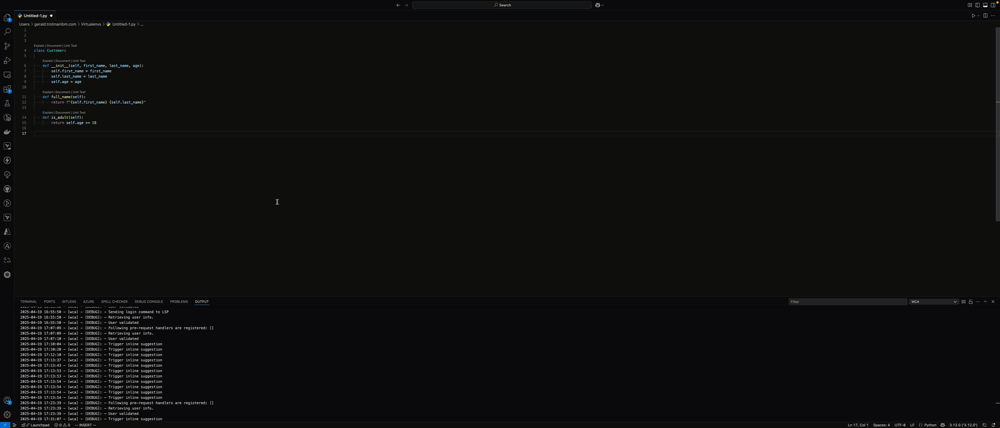

# IBM watsonx Code Assistant Prompting Guide: Practical hands-on


  
▶️ _A code editor extension that captures and transmits prompt and context information for inference and captures feed-back from the user to improve model and service quality._

▶️ _An inference pipeline for combining and processing natural language and code to get code suggestions from a Large Language Models (LLMs)._

▶️ _A content matching pipeline that finds training examples that are similar to the code suggestions._

▶️ _An analysis framework that collects and processes feedback data to make it consumable by a wide range of analysis tools, ultimately for the purpose of improving model quality and user experience._

One of the key advantages of watsonx Code Assistant is its ability to leverage **context** and industry **best practices** to generate intelligent suggestions. As you use watsonx Code Assistant, you'll notice that it incorporates context from the overall source file and the specific paragraph to provide more accurate recommendations. It analyzes the code you have already written and suggests improvements or additions based on established best practices.

---

## Here are a few key examples of simple ways to enhance your experience👇

### Use personas or role names to provide context

The LLM supporting watsonx Code Assistant is tuned to support 116 different programming languages. When prompting for content, explanations, or opportunities for improvement, it's important to provide context that includes the role or persona that would otherwise be expected to produce the content without AI. 

Let's start with a basic query for language recommendations. Suppose you work for an operational technology company that produces embedded systems, sensors, and other instruments. You want to implement the UNIX `cat` command and ask the following question:

**Good:** `Between C, C++, and Ada, which language is best for implementing the UNIX "cat" command?`

This is a good start, and one improvement would be to prepend a sentence that provides more context. Consider the following:

**Better:** `You are an embedded systems programmer. Between C, C++, and Ada, which language is best for implementing the UNIX "cat" command?`

This is better because the needed skillset is now much clearer. Finally, it would help to include any specific requirements. For example:

**Best:** `You are an embedded systems programmer building secure fielded instruments. Between C, C++, and Ada, which language is best for implementing the UNIX "cat" command?`

This is better than **Better** because the prompt makes visible the security needs, thus avoiding a follow up prompt such as, `What if I need robust security capabilities?`

<br>

### Avoid "give me a rock / no, not that rock" by starting with specific details, to reduce iterations

Remember when you first learned how to code? Perhaps your instructor said that computers will do exactly what you tell them to do. LLMs aren't very different in that regard, so take the time to add important details to your prompts. For example:

**Good:** `You are an Ansible engineer. Write a playbook that deploys IBM MQ on OpenShift.`

This is also a good start, but you might get content that supports older versions of OpenShift like OCP 3. If you need OpenShift 4 support, modify your prompt by adding a "4" at the end.

**Better:** `You are an Ansible engineer. Write a playbook that deploys IBM MQ on OpenShift 4.`

This is more specific, but then you notice the proposed content suggests passing OpenShift CLI commands instead of using a bespoke Ansible module, which may not be idempotent. Further, the proposed content uses short module names which is a linting violation; and you remember that, in OpenShift, services are not exposed as routes by default.

**Best:** `You are an Ansible engineer. Write a playbook that deploys IBM MQ on OpenShift 4 with an exposed route. Use the kubernetes.core collection. Use fully qualified collection names.`

By being more specific, you can generate more useful code and spend less time correcting. The good news here is that watsonx Code Assistant retains context in each chat, which means you can propose corrections conversationally instead of having to rewrite the entire prompt.

### Parameterize Parameterize Parameterize

#### What is already working on the backend (Prompt Engineering)

First, let's give a little context. **Parameterization** in the context of ***Prompt Engineering*** are the adjusted settings that go into the inherent behavior of your model for particular use case or set of use cases. Here are a couple of key Prompt Engineering parameters and how they work that I think are the most relevant:

**Temperature** controls the randomness of responses. Lowering it (around 0.1) yields consistent, predictable outputs, while raising it (around 0.9) produces creative responses with varying degrees of variability.

**Stop sequences** tell the model when to end its response and acknowledges when a question has been fully answered.

**Top-k** puts a hard limit on how many word choices the model considers at each step of its thought process. If for example, the top-k is set to say 50, the model then picks from ONLY the 50 most likely next words, ignoring less probable ones.

**Top-p sampling** aka nucleus sampling, works by considering words based on their cumulative probability. With a lower value, the model sticks to high-confidence words, giving you more focused and reliable answers.

**Frequency vs. Presence penalties** combat repetition. Frequency penalizes reusing words, while presence encourages exploring new topics.


**Logit bias** lets you make specific words more or less likely to show up in ones responses. This is handy when you want to steer the model toward or away from certain terminologies.

#### Why this matters

For the purposes of our use case, **Code Generation**, we have optimized those backend **parameters**, such as **Temperature**, where the value threshold is set low enough to provide consistent and predictable outputs while allowing creative responses when appropriate. Additionally, we have coupled this with **Stop sequences** that are clear and produce structured functional code that adheres to proper syntax rules.

#### Where the magic happens (You, the Prompt Whisperer)

As a consumer

#### Hard Prompting
 
Code generation is inherently an exercise in **hard prompting**. This process involves humans providing specific instructions as prompts to the AI domain expert, expecting a precise and accurate response from the expert. . As a warm up, say I ask WCA to do something so generic as the following:

```bash
Write Python code to sort an array using the bubble sort algorithm.
```

Watson Code Assistant would respond with:

"*Here's a Python implementation of the bubble sort algorithm:*

```
# Assisted by watsonx Code Assistant 

def bubble_sort(arr):
    n = len(arr)

    for i in range(n):
        for j in range(0, n - i - 1):
            if arr[j] > arr[j + 1]:
                arr[j], arr[j + 1] = arr[j + 1], arr[j]

# Example usage:

arr = [64, 34, 25, 12, 22, 11, 90]
bubble_sort(arr)
print("Sorted array is:", arr)
```
*This code defines a function ```bubble_sort``` that takes an array as input and sorts it using the bubble sort algorithm. The outer loop iterates through the array, and the inner loop compares adjacent elements and swaps them if they are in the wrong order. The process repeats until the array is sorted. The example usage demonstrates how to use the 
```bubble_sort``` function to sort an array.*"

> **NOTE:** In its response, the nature of the question was so generic yet specialized in its domain that it felt compelled to provide an **Example usage** without me asking for it.


However, if you use hard-coded information in your prompt (making your hard prompt too hard), there's an excellent chance the response will be anonymized or otherwise different from what you prompted. For example, if you prompt with:

```bash
You are a Cisco NXOS engineer. Write a script that sets the secondary interface IPv4 address for Ethernet1/2 to 194.99.2.254/24.
```

You might get a response that uses a different number in the fourth octet of the IPv4 address, or a different IPv4 address entirely. Consider this improvement:

```bash
You are a Cisco NXOS engineer. Write a script that sets the secondary interface IPv4 address for a parameterized layer 1 interface name to a parameterized IPv4 address formatted as CIDR.
```

You could even give an example:

```bash
You are a Cisco NXOS engineer. Write a script that sets the secondary interface IPv4 address for a parameterized layer 1 interface name like "Ethernet1/2" to a parameterized IPv4 address formatted as CIDR like "192.168.1.200/24."
```

Experiment with different approaches, but remember that the use of hard-coded data is an anti-pattern.

#### Soft Prompting

Conversely, when code generation occurs without explicit instructions and the AI is provided with subtle guidance, the AI begins to generate prompts as prefix vector embeddings that are incomprehensible to humans. This phenomenon is commonly referred to as **soft prompting**.

**Watson Code Assistant**, and code assistants in general, benefit from this technique in the form of single and multi-line code completion, which has made the solution so powerful in the present day. So for example, I ask WCA to do something traditional in the context of object oriented programming such as:

```bash
Create a python class Customer. Include attributes for firstName, lastName, and age.
```

Watson Code Assistant would respond with:

"*Here's a Python class named ```Customer``` with attributes for ```firstName```, ```lastName```, and ```age```:*

```
 # Assisted by watsonx Code Assistant 
 

class Customer:

    def __init__(self, first_name, last_name, age):
        self.first_name = first_name
        self.last_name = last_name
        self.age = age

    def full_name(self):
        return f"{self.first_name} {self.last_name}"

    def is_adult(self):
        return self.age >= 18

```
*This class has three attributes: ```first_name```, ```last_name```, and ```age```. The ```__init__``` method initializes these attributes when a new Customer object is created. The ```full_name``` method returns the customer's full name, and the ```is_adult``` method checks if the customer is an adult (18 years or older).*"

> **NOTE:** I am deliberately omitting the example in the response to articulate the following point. 

Now for the fun part. You've just copied the fruits of your **hard prompting** efforts from the prompt chat into your code file. Your results, which in effect act as a **parameterization** for **soft prompting** take over when asked to provide an example usage of your code **in-line** like so:  



As expected, it instantiates customer object examples and provides what those example results would be. 

### Generating API version specific code.

When working with certain APIs such as Azure API, the code  will use an API with a specific version date:

The Prompt:

```
Write a bicep to create a keyvault
```

The code output generated by WCA includes the following dated Azure API version:

```
...
resource keyVault 'Microsoft.KeyVault/vaults@2019-09-01' = {
  name: keyVaultName

```

But is that the newest API version available in the training data? We can ask the model:

```
List only the dates of the KeyVault Azure API available to you.
```

We receive the following output:

```
Here are the dates for the available Key Vault API versions as of April 2024:

2015-06-01
2016-10-01
2017-09-01
2018-02-14
2018-11-30
2019-09-01
2019-10-01
2020-01-01
2021-04-01
2021-10-01
2023-02-01
```

So we can take this information and request that a specific API version is used:

The Prompt:

```
Write a bicep to create a keyvault using this API version Microsoft.KeyVault/vaults@2023-02-01
```

And the output:

```
...
resource keyVault 'Microsoft.KeyVault/vaults@2023-02-01' 
```


### Encapsulate separate contexts into separate chats

The IBM watsonx Code Assistant extension for Microsoft VS Code is based on a chat-oriented core. When you start a new chat, there is no context until after you have submitted your first prompt. Using the context and persona practices above, you can establish context early and link to specific files in your repo using `@<filename>`. Your subsequent prompts may then refer to previous outputs, and you can use relative language without needing to re-input your progress or generated content. 

For example, given the following initial prompt:

```txt
You are an Ansible engineer. Begin developing a new Ansible role called mq-ocp that deploys IBM MQ to OpenShift 4 with an exposed route. Use the kubernetes.core collection. Use fully qualified collection names. Use parameterization for the kubernetes and MQ resources wherever possible. Format the output as tasks only, suitable for tasks/main.yml.
```

Once you are happy with the generated content, you can follow up with subsequent prompts like the following:

```txt
Generate defaults/main.yml.

Generate argSpec.

Generate meta/main.yml.

Generate a README.md that includes a synopsis, prerequisites, dependencies, up & running, task explanations, parameter explanations, author, and license information.

Generate a top-level play called ibm-mq-day0-playbook.yml that runs this role on an inventory called rhel9Servers.
```

**NOTE:** Before you start a new coding session, be sure to start a new chat if you need to start from a clean slate!

### Also good to remember

**Neatness counts!** Be sure to capitalize the beginning of your sentences, separate sections using commas, and end sentences with periods or question marks. You may even find that good manners get you different results: try using "please" and see what happens!

**Write down your good prompts!** It's good practice to create a simple `prompts.md` file to keep your prompts in after they are producing good results. You can use them to test updated LLMs as well.

## Test your knowledge so far: Personas & Details

Here's another example, where we need to refactor an Azure bicep.

**Initial attempt:** Update the @deploy.bicep for keyvault to include an event grid system topic which will stream to an azure logic app uri

Based on the guidelines discussed above, how might you improve this prompt?

**Your attempt:**


---


**_Final Tips for an Optimal Usability Experience_**

**1** - _Although generative AI can be incredibly useful, it can sometimes produce answers that aren't exactly what you're looking for, or it can give you suggestions that seem off track. If this happens, don't hesitate to rewrite or reformulate your request. Your opinion is fundamental in guiding the AI to provide more precise, meaningful and relevant answers._

**2** - _Do not hesitate to utilize extensive prompts; in certain scenarios, this approach can enhance the accuracy of prompt suggestions generated by the AI. In summary, a well-crafted prompt is crucial for optimal outcomes._

---
